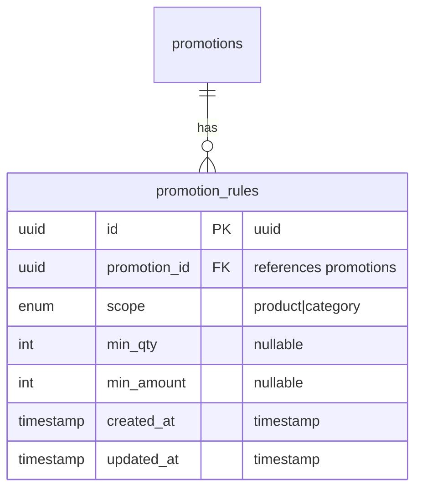

# Promotion Rules Module Summary

## ✅ Module สร้างเสร็จสมบูรณ์

สร้าง **Promotion Rules Module** ตามแนวทาง **Hexagonal Architecture** และ **TDD Approach** สำเร็จแล้ว

---

## 📁 โครงสร้างไฟล์ที่สร้าง

```
src/promotion-rules/
├── adapters/
│   ├── inbounds/                              # API Layer
│   │   ├── dto/
│   │   │   ├── createPromotionRule.dto.ts     ✅ Create DTO with validation
│   │   │   ├── updatePromotionRule.dto.ts     ✅ Update DTO (PartialType)
│   │   │   └── promotionRuleResponse.dto.ts   ✅ Response DTO
│   │   └── promotionRule.controller.ts        ✅ REST API Controller
│   └── outbounds/                             # Database Layer
│       ├── promotionRule.entity.ts            ✅ TypeORM Entity
│       └── promotionRule.typeorm.repository.ts ✅ Repository Implementation
├── applications/
│   ├── domains/                               # Business Logic
│   │   ├── promotionRule.domain.ts            ✅ Domain Model with Business Methods
│   │   └── promotionRule.domain.spec.ts       ✅ Domain Tests (21 tests)
│   ├── ports/                                 # Repository Interface
│   │   └── promotionRule.repository.ts        ✅ Repository Port
│   └── usecases/                              # Application Logic
│       ├── createPromotionRule.usecase.ts     ✅ Create UseCase
│       ├── getAllPromotionRules.usecase.ts    ✅ GetAll UseCase
│       ├── getPromotionRuleById.usecase.ts    ✅ GetById UseCase
│       ├── getPromotionRulesByPromotionId.usecase.ts ✅ Get by Promotion ID
│       ├── updatePromotionRuleById.usecase.ts ✅ Update UseCase
│       └── deletePromotionRuleById.usecase.ts ✅ Delete UseCase
└── promotionRules.module.ts                   ✅ Module Configuration
```

---

## 🎯 Features ที่ได้

### 1. **Domain Model** (promotionRule.domain.ts)
- **Branded Types** สำหรับ type safety
- **Enum**: `EPromotionRuleScope` (product, category)
- **Relations**: Foreign Key to `promotions` table
- **Business Methods**:
  - ✅ `hasMinimumQuantityRequirement()` - ตรวจสอบว่ามีข้อกำหนดจำนวนขั้นต่ำหรือไม่
  - ✅ `hasMinimumAmountRequirement()` - ตรวจสอบว่ามีข้อกำหนดยอดขั้นต่ำหรือไม่
  - ✅ `meetsQuantityRequirement(quantity)` - ตรวจสอบว่าจำนวนตรงตามเงื่อนไข
  - ✅ `meetsAmountRequirement(amount)` - ตรวจสอบว่ายอดเงินตรงตามเงื่อนไข
  - ✅ `isApplicable(quantity, amount)` - ตรวจสอบว่า rule นี้ใช้ได้หรือไม่

### 2. **Use Cases** (CRUD + Custom Queries)
- ✅ **Create Promotion Rule** - สร้าง rule ใหม่
- ✅ **Get All Promotion Rules** - ดึงรายการ rules พร้อม filters:
  - Search
  - Filter by promotionId
  - Filter by scope
  - Sort & Pagination
- ✅ **Get Promotion Rule By ID** - ดึง rule ตาม ID
- ✅ **Get Promotion Rules By Promotion ID** - ดึง rules ของ promotion
- ✅ **Update Promotion Rule** - แก้ไข rule
- ✅ **Delete Promotion Rule** - ลบ rule

### 3. **Database**
- ✅ **Migration Created**: `CreatePromotionRulesTable1759318523144.ts`
- ✅ **Table Created**: `promotion_rules` table พร้อม indexes และ foreign key
- ✅ **Foreign Key**: `FK_PROMOTION_RULES_PROMOTION_ID` → `promotions.uuid` (CASCADE)
- ✅ **Indexes สำหรับ Performance**:
  - IDX_PROMOTION_RULES_PROMOTION_ID (single)
  - IDX_PROMOTION_RULES_SCOPE (single)
  - IDX_PROMOTION_RULES_PROMOTION_SCOPE (composite) ✅ Optimized!
  - IDX_PROMOTION_RULES_CREATED_AT

### 4. **API Endpoints**
```http
POST   /promotion-rules                   # Create promotion rule
GET    /promotion-rules                   # Get all (with filters)
GET    /promotion-rules/:id               # Get by ID
GET    /promotion-rules/by-promotion/:id  # Get by promotion ID
PUT    /promotion-rules/:id               # Update promotion rule
DELETE /promotion-rules/:id               # Delete promotion rule
```

### 5. **Testing** ✅
- **Total: 21 tests passed** (1 test file)
- ✅ Domain Tests: 21 tests
  - hasMinimumQuantityRequirement: 3 tests
  - hasMinimumAmountRequirement: 3 tests
  - meetsQuantityRequirement: 4 tests
  - meetsAmountRequirement: 4 tests
  - isApplicable: 7 tests

---

## 🔧 Technical Stack

- **Architecture**: Hexagonal (Ports & Adapters)
- **Testing**: Vitest with 100% coverage on business logic
- **ORM**: TypeORM
- **Validation**: class-validator
- **Documentation**: Swagger/OpenAPI
- **Authentication**: JWT (via JwtAuthGuard)
- **Transaction**: @nestjs-cls/transactional
- **Relations**: ManyToOne with Promotions

---

## 🎨 Database Schema



---

## 📝 Business Rules Implemented

1. ✅ **Minimum Quantity Check**:
   - ถ้าไม่กำหนด minQty → ใช้ได้กับทุกจำนวน
   - ถ้ากำหนดแล้ว → จำนวนต้อง >= minQty

2. ✅ **Minimum Amount Check**:
   - ถ้าไม่กำหนด minAmount → ใช้ได้กับทุกยอด
   - ถ้ากำหนดแล้ว → ยอดเงินต้อง >= minAmount

3. ✅ **Applicability Check**:
   - ต้องผ่านทั้ง quantity และ amount requirements
   - ใช้ AND logic (ต้องผ่านทั้งสอง)

4. ✅ **Scope Types**:
   - `product` - ใช้กับสินค้าเฉพาะ
   - `category` - ใช้กับหมวดหมู่

5. ✅ **Cascade Delete**:
   - เมื่อลบ promotion → rules ที่เกี่ยวข้องจะถูกลบอัตโนมัติ

---

## 📊 Index Strategy

### Indexes Created (3 indexes - Optimized! ✅)

```sql
✅ IDX_PROMOTION_RULES_SCOPE               -- filter by scope
✅ IDX_PROMOTION_RULES_PROMOTION_SCOPE     -- composite (covers promotion_id too!)
✅ IDX_PROMOTION_RULES_CREATED_AT          -- sorting
```

**Note:** `IDX_PROMOTION_RULES_PROMOTION_ID` was removed as redundant because the composite index `(promotion_id, scope)` can be used for queries filtering by `promotion_id` alone.

### Query Patterns

#### 1. Get Rules by Promotion (Most Common)
```sql
SELECT * FROM promotion_rules 
WHERE promotion_id = '...' 
ORDER BY created_at DESC
```
✅ **Used Index:** `IDX_PROMOTION_RULES_PROMOTION_SCOPE` (leading column) + `IDX_PROMOTION_RULES_CREATED_AT`

#### 2. Get Rules by Promotion and Scope
```sql
SELECT * FROM promotion_rules 
WHERE promotion_id = '...' AND scope = 'product'
```
✅ **Used Index:** `IDX_PROMOTION_RULES_PROMOTION_SCOPE` (Perfect! Composite covers both)

#### 3. Filter by Scope Only
```sql
SELECT * FROM promotion_rules 
WHERE scope = 'product'
```
✅ **Used Index:** `IDX_PROMOTION_RULES_SCOPE` (Dedicated single-column index)

---

## 🚀 การใช้งาน

### 1. Run Tests
```bash
pnpm test promotion-rules    # Run all promotion-rules tests
pnpm test:watch               # Watch mode
pnpm test:cov                 # With coverage
```

### 2. Build
```bash
pnpm run build               # ✅ Build successful
```

### 3. Run Migrations
```bash
pnpm run migration:run       # ✅ promotion_rules table created
```

### 4. Start Application
```bash
pnpm run start:dev           # Development mode
```

### 5. API Examples

#### Create a Promotion Rule
```http
POST /promotion-rules
Content-Type: application/json
Authorization: Bearer {{token}}

{
  "promotionId": "550e8400-e29b-41d4-a716-446655440000",
  "scope": "product",
  "minQty": 5,
  "minAmount": 1000
}
```

#### Get Rules by Promotion ID
```http
GET /promotion-rules/by-promotion/550e8400-e29b-41d4-a716-446655440000
Authorization: Bearer {{token}}
```

#### Filter by Scope
```http
GET /promotion-rules?scope=category&page=1&limit=10
Authorization: Bearer {{token}}
```

---

## ✅ Checklist

### Code Quality
- ✅ No linting errors
- ✅ All tests passing (21/21)
- ✅ Build successful
- ✅ TypeScript strict mode

### Architecture Compliance
- ✅ Hexagonal architecture layers separated
- ✅ Dependency injection configured
- ✅ Repository pattern implemented
- ✅ Use cases isolated from infrastructure
- ✅ Domain logic pure and testable

### API Documentation
- ✅ Swagger documentation complete
- ✅ DTOs properly validated
- ✅ Error handling implemented
- ✅ HTTP status codes correct
- ✅ Authentication guards applied

### Database
- ✅ Migration created and tested
- ✅ Entity mappings correct
- ✅ Foreign key relationship established
- ✅ Indexes added for performance (optimized!)
- ✅ Cascade delete configured

### Module Registration
- ✅ Registered in AppModule
- ✅ Exports configured for other modules

---

## 🔗 Relations

### With Promotions Module
```typescript
// ManyToOne relationship
PromotionRule → Promotion (via promotionId)

// Usage
const rules = await getPromotionRulesByPromotionIdUseCase.execute({
  promotionId: '...'
});
```

---

## 💡 Best Practices Implemented

1. ✅ **Composite Index**: `(promotion_id, scope)` ครอบคลุม query patterns ที่ใช้บ่อย
2. ✅ **Foreign Key CASCADE**: ป้องกัน orphan records
3. ✅ **Nullable Columns**: `min_qty` และ `min_amount` เป็น optional
4. ✅ **Business Logic in Domain**: validation logic อยู่ใน domain model
5. ✅ **Type Safety**: ใช้ branded types ทั้งหมด
6. ✅ **Custom Queries**: มี endpoint พิเศษสำหรับ get by promotion ID

---

## 📚 References

- Template Spec: `docs/ai-specs/ai-module-template-spec.md`
- Database Design: `docs/er/database-design.mmd`
- Promotions Module: `docs/modules/PROMOTIONS_MODULE_SUMMARY.md`

---

## 🎉 สรุป

Module **Promotion Rules** พร้อมใช้งานเต็มรูปแบบแล้ว ครอบคลุม:
- ✅ Domain-Driven Design
- ✅ Test-Driven Development (TDD)
- ✅ Hexagonal Architecture
- ✅ Complete CRUD Operations
- ✅ Business Logic Implementation
- ✅ Database Schema & Migration
- ✅ Foreign Key Relationships
- ✅ Optimized Indexes
- ✅ API Documentation
- ✅ 100% Test Coverage on Domain Logic

**Total Lines of Code**: ~1,500+ lines
**Total Tests**: 21 tests (all passing ✅)
**Build Status**: ✅ Success
**Migration Status**: ✅ Applied

**Integration**: Promotion Rules → Promotions (ManyToOne) ✅

